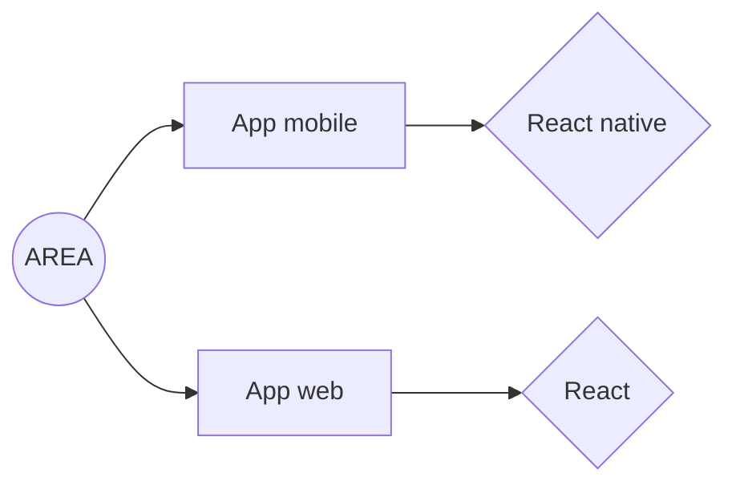

# Area

<!-- TABLE OF CONTENTS -->

  
Table of Contents

  <ol>
    <li>
      <a href="#about-the-project">About The Project</a>
    </li>
    <li>
      <a href="#about-the-project">Description</a>
    </li>
    <li><a href="#members">Members</a></li>
    <li>
      <a href="#infrastructure">Infrastructure</a>
      <ul>
        <li><a href="#front">Front</a></li>
        <li><a href="#back">Back</a></li>
      </ul>
    </li>
    <li>
      <a href="#installation">Installation</a>
      <ul>
        <li><a href="#prerequis">Prerequis</a></li>
        <li><a href="#release">Run for release</a></li>
        <li><a href="#dev">Run for development</a></li>
      </ul>
    </li>
  </ol>

## About The Project

## Description

- **Taille du groupe** : 6
- **Compilation** : docker-compose build && docker-compose up
- **Langage** :

  
  
  

## Members

- Damien Maillard (Dev Fullstack)
- Ilian Baylon
- Jules Clerc
- Houssam El-affas 
-Gregoire Duhem

## Infrastructure

### Front

### Back

# Installation
- Prérequis.
  > Docker

- Run for release
  > docker-compose up --build
- Run for development
  > docker-compose -f docker-compose.dev.yml up --build <front|back|mobile>

## Access to the back-end

http://localhost:8080/<route>

## Access to the front-end

http://localhost:8081
