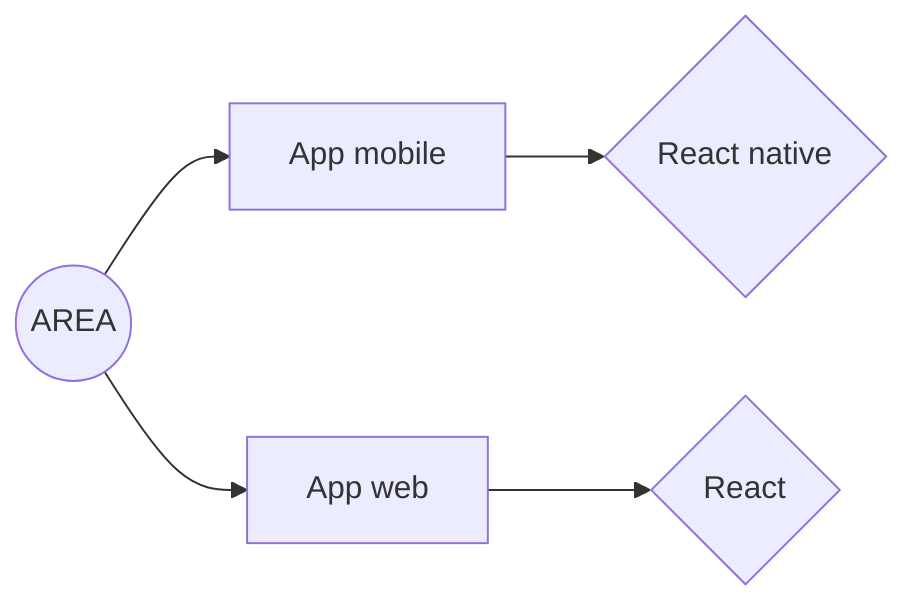
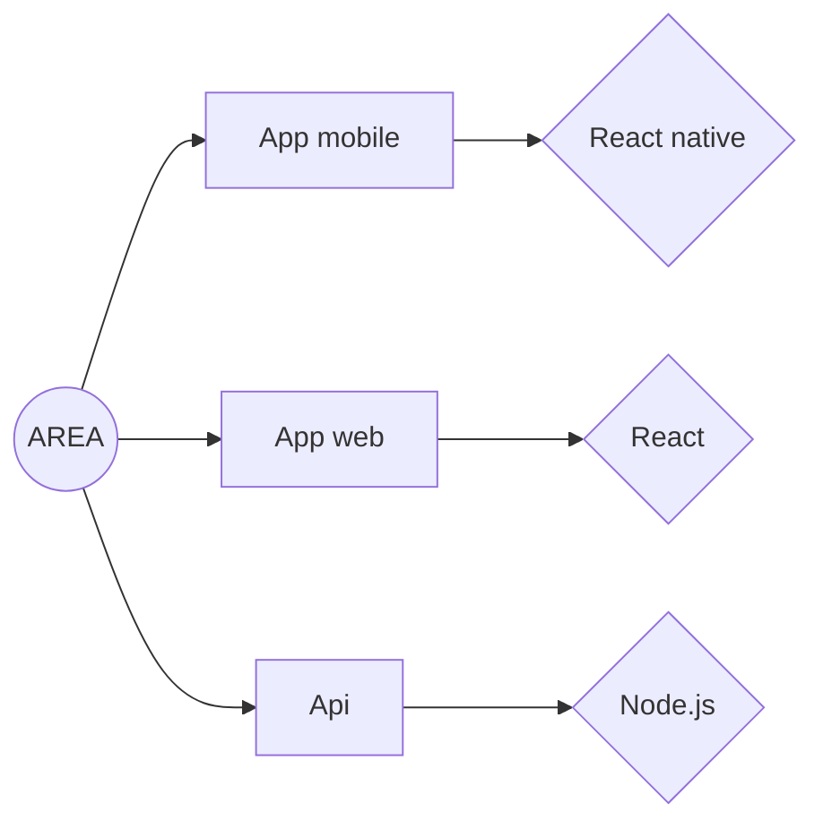

# Area

## Description

- **Taille du groupe** : 6
- **Compilation** : docker-compose build && docker-compose up
- **Langage** : 

  
  
  

## Groups

- Damien Maillard (Dev Fullstack)
- Ilian Baylon
- Jules Clerc
- Houssam El-affas 
-Gregoire Duhem

## Infrastructure

### Front

### Back

# Installation
- Prérequis.
  > Docker

- Run for release
  > docker-compose up --build
- Run for development
  > docker-compose -f docker-compose.dev.yml up --build
  > docker-compose -f docker-compose.dev.yml up --build <front|back|mobile>`

## Access to the back-end

http://localhost:8080/<route>

## Access to the front-end

http://localhost:3000

## Back

- [Back](back/README.md)
